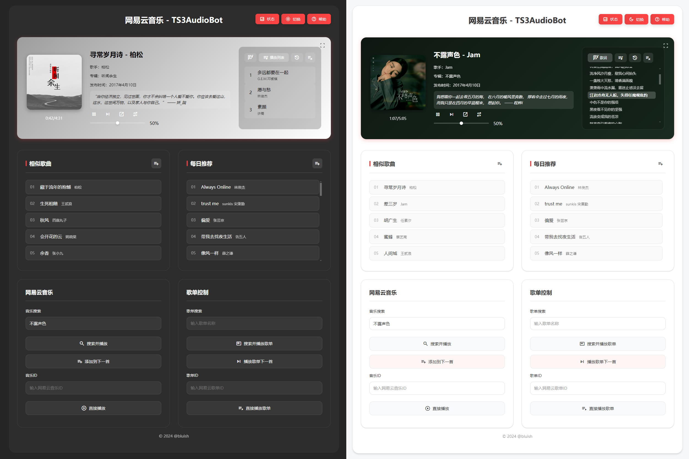

# 网易云音乐 - TS3AudioBot_NetEase_WebUI

一个美观、现代的 TS3AudioBot 网易云音乐 Web 界面，提供丰富的音乐播放和管理功能。



## ✨ 功能特色

- 🎵 网易云音乐或歌单搜索和播放
- 🎮 播放器控制（播放/暂停、音量、播放模式）
- 📝 实时歌词显示
- 💬 热门评论轮播
- 🎨 动态背景颜色
- 🖼️ 沉浸模式播放
- 📋 播放列表管理
- 📊 播放历史记录
- 🎯 相似歌曲推荐
- 📅 每日音乐推荐
- 🌓 明暗主题切换
- 🎯 帮助交互引导

## 🚀 部署介绍
 此项目为魔改TS3AudioBot中Webinterface的Index.html，原理为通过TS3AudioBot和网易云音乐的API实现页面端操控与展示。
 
1. 本项目适用于搭配TS3AudioBot-NetEaseCloudmusic-plugin(需包含`!yun list`、`!yun clear`功能，因此可选[wellwhz版](https://github.com/wellwhz/TS3AudioBot-NetEaseCloudmusic-plugin)或[原版DEV分支](https://github.com/ZHANGTIANYAO1/TS3AudioBot-NetEaseCloudmusic-plugin/tree/DEV))与[NeteaseCloudMusicApi](https://gitlab.com/Binaryify/neteasecloudmusicapi)的[TS3AudioBot](https://github.com/Splamy/TS3AudioBot)。请先完成这些项目的部署。
2. 将本项目`index.html` 替换TS3AudioBot的 `WebInterface` 目录下的同名文件，将文件中的五处`127.0.0.1:3000`替换为你的NeteaseCloudMusicApi地址。
3. 在Rights.toml中为Api配置访问权限：
```
# Web API规则
[[rule]]
	# 匹配来自Web API的请求
	isapi = true
	# 给予所有权限
	"+" = "*"
```
4. 运行TS3Audiobot，即可访问58913端口。